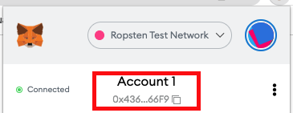
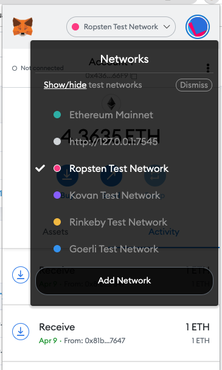
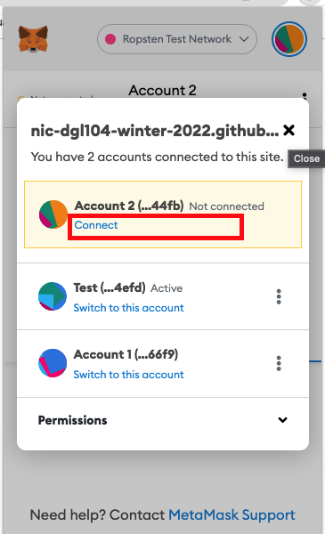
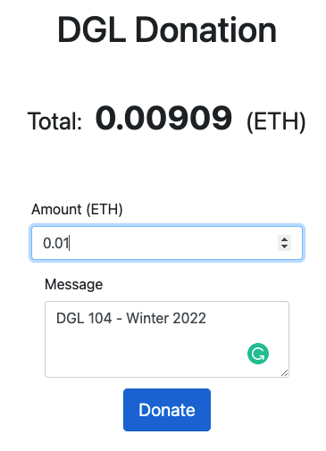
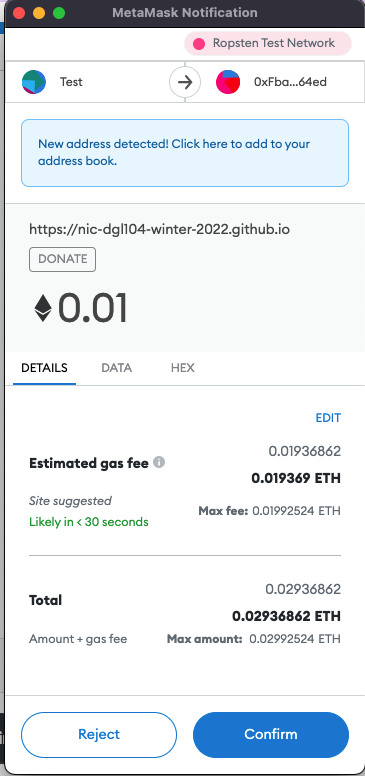
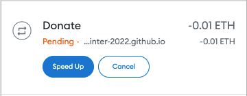
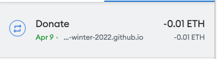
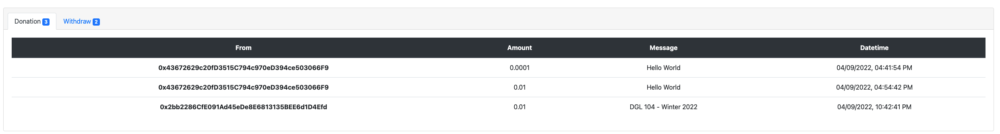

# Phat's Community Coding Project
Link: https://nic-dgl104-winter-2022.github.io/phat-community-code/

Contract: ```0xFbaaffc28904ADd40dc695432BB035B8Ca1464ed``` 

Creator: ```0x43672629c20fD3515C794c970eD394ce503066F9``` (Only this wallet can withdraw)

## Introduction
This application is a crowdfunding application in which the users donate ETH to the **DGL Donation** through a smart contract. In other words, the donation process has no intermediary and directly sends cryptocurrencies from the user wallet to the organization. The data about donations are public, and any transaction can be seen in the network, including withdrawal transactions.

I decided to choose Ropsten as the testnet for this application because it is a personal project. It only transfers "fake money" on the testnet for the demonstration.

I use [Remix](https://remix.ethereum.org/) to code and compile the smart contract. On the other hand, the web application only use plain JavaScript. There are other libraries I use for this project:

- [Bootstrap v4](https://getbootstrap.com/docs/4.6/getting-started/introduction/)
- [Web3.js](https://web3js.readthedocs.io/en/v1.7.1/index.html)
- [OpenZeppelin](https://docs.openzeppelin.com/)

***The project requires the users to install MetaMask for the donate feature.***

# How to test it ?
## Install MetaMask
Firstly, you need to install the MetaMask extension. It is available on both Firefox and Chrome. Remember to store the secret seeds for backup purposes. 

This is your wallet's address. Click on it in MetaMask to copy your address.


<br>

Not change it to the Ropsten network:


<br>

## Find some ETH
You need some ETH tokens to donate to the DGL Donation. There are a few available faucet for you:

- https://faucet.dimensions.network/ 
- https://faucet.egorfine.com/ 
- https://faucet.metamask.io/ 

If  above link don't work, use can use this test wallet. Import into your MetaMask with this private key:
```6ccc09767d1fdaf2e349a3fe8afcdd2fe59b51df33b9b773c4d11639de5ac054```

## Allow MetaMask to connect to the website
For the first attempt, you need to connect MetaMask with the website. Ensure to connect each time you switch between wallets.


<br>


If you connected, it will display the text "Connected" next to your address.

## Donate and leave a message

<br>

After you input the amount and message, MetaMask requires your signature to proceed the transaction. Confirm it and wait for the status of the result.

<br>

<br>

It takes few seconds.


<br>
<br>

The transaction is successfully made.


<br>

When you have the result is successful, refresh the website then you will see your donation in the table.


<br>


## Files
Filename | Description
--- | ---
build/DGLDonation.json | It uses to communicate between the application and contract
contracts/DGLDonation.sol | This file is the main contract that handles the logic of the application. It receives donations and allows the creator to withdraw.
contract/*.sol | Utility files from **OpenZeppelin**
app.js | Get data and send transaction
index.html | Main webpage

## Code description
### Contract
I define two struct types to represent Donation and Withdraw transactions. In particular, each donation contains information about the donator, the amount of ETH, the message, and the timestamp. On the other hand, any withdrawal has a message, amount of ETH, and timestamp.
```solidity
  struct Donation {
      uint id;
      address owner;
      string message;
      uint amount;
      uint timestamp;
  }
  Donation[] public donations;
  uint public donationCounter;

  struct WithdrawRecord {
      uint id;
      string message;
      uint amount;
      uint timestamp;
  }
  WithdrawRecord[] public withdrawRecords;
  uint public withdrawCounter;
```

I declare two arrays to record donations and withdrawals. However, I also define two counters to keep track of their length. In addition, the client can use this variable to get data while using the loop.

Ethereum uses ETH as a native token for transferring between wallets. However, it is divided into different units. 

- 1 ETH = 1e18 wei
- 1 ETH = 1e9 Gwei

In addition, the donators will receive points if their donation is equal to or greater than 1 Gwei. In other words, 1 point equals 1 Gwei in this contract. The idea of having relevant points is to make an extension on this project, like buying stickers or badges.

### Javascript
For the Javascript code, I use a library like Web3.js to convert values between units in ETH. Furthermore, I interact with MetaMask to handle the confirmation before sending a transaction.
